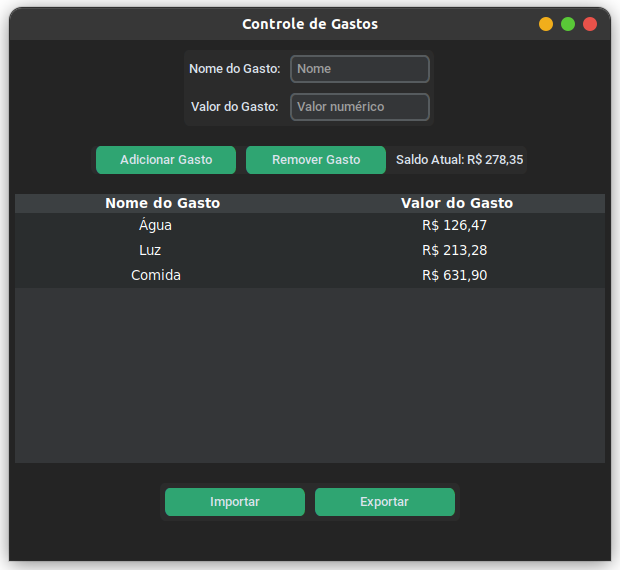
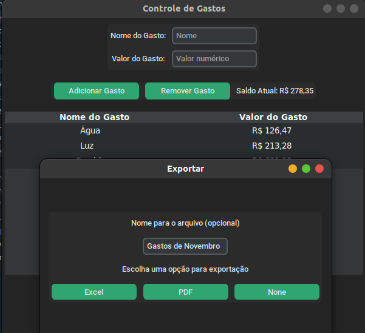
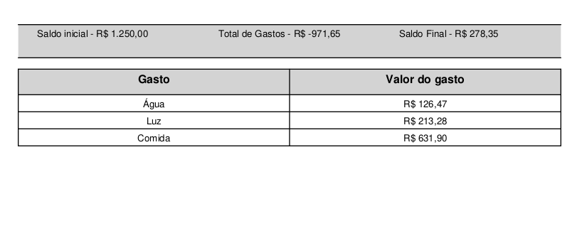
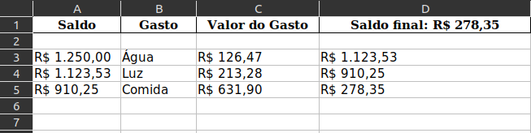

## Aplicação de Controle de Gastos em python

Uma aplicação para facilitar a criação de planilhas de gastos usando apenas o nome e o valor de um gasto.

Desenvolvida totalmente para uso de brasileiros. Utiliza o formato em BRL (R$) e tem seus valores exportados apenas dessa maneira. Atualmente não suporta outros formatos. 
>
### Instalação

1. Clone o repositório: `git clone https://github.com/iamtwobe/notdeployedyet.git`
2. Instale as dependências: `pip install -r requirements.txt`
3. Execute a aplicação: `python main.py`

>

### Uso

1. Execute a aplicação: `python main.py`
2. Insira o saldo inicial quando solicitado.
3. Adicione gastos usando a interface gráfica. Utilize "`-`" (menos) para adicionar um valor recebido, ao invés de gasto (Ao invés de ser reduzido como normalmente seria, é somado ao Saldo).
4. Exporte para Excel ou PDF para guardar as informações.
5. Importe arquivos exportados em Excel para editar informações salvas.

- Para exportar para Excel ou PDF, você só precisa adicionar um nome para o arquivo que será salvo e em seguida escolher um local para salvar o arquivo. Caso você não coloque um nome, ele receberá o nome padrão como "Controle de Gastos.(formato)" 

- Para importar arquivos, apenas o formato Excel está disponível (atualmente). Para importar, basta selecionar a opção de importação (Você pode fornecer um valor temporário no saldo inicial apenas para chegar à tela da aplicação) e escolher um arquivo que tenha sido exportado pela aplicação anteriormente. Arquivos feitos manualmente ou por outras aplicações possivelmente não irão funcionar, a importação é exclusiva para arquivos feitos por este modelo.

>

### Capturas de Tela

 

>

### Contribuição

Sinta-se à vontade para [abrir uma issue](link_para_abrir_issue) ou enviar um [pull request](link_para_pull_request).

>

### Contato

Se você tiver alguma dúvida ou encontrar algum problema, por favor, [abra uma issue](link_para_abrir_issue) ou entre em contato por uma de minhas [redes sociais](https://linktr.ee/iamtwobe).

>

### Status do Projeto

- Futuramente versão compatível com outros países, moedas e linguagens.

>Este projeto está em desenvolvimento ativo.